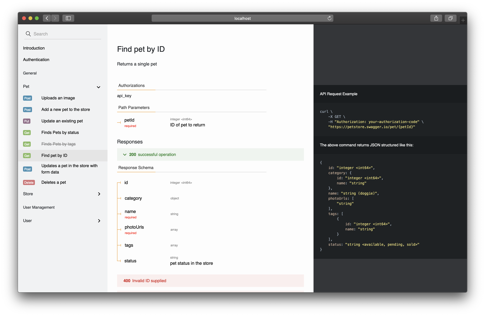

# React Swagger
An web interface for Swagger based on React.js

## [Live Demo](https://asset.kenyip.cc/swagger-demo.html)


## Installation
Replace the data-script attribute with your swagger url. 
```html
<!DOCTYPE html>
<html>
    <head>
        <title>Pet Store</title>
        <meta charset="utf-8"/>
        <meta name="viewport" content="width=device-width, initial-scale=1">
    </head>
    <body>
        <div id="root"></div>
        <doc data-script="https://asset.kenyip.cc/pet-store-swagger.json"></doc>
        <script src="https://asset.kenyip.cc/react-swagger.js"> </script>
    </body>
</html>
```

